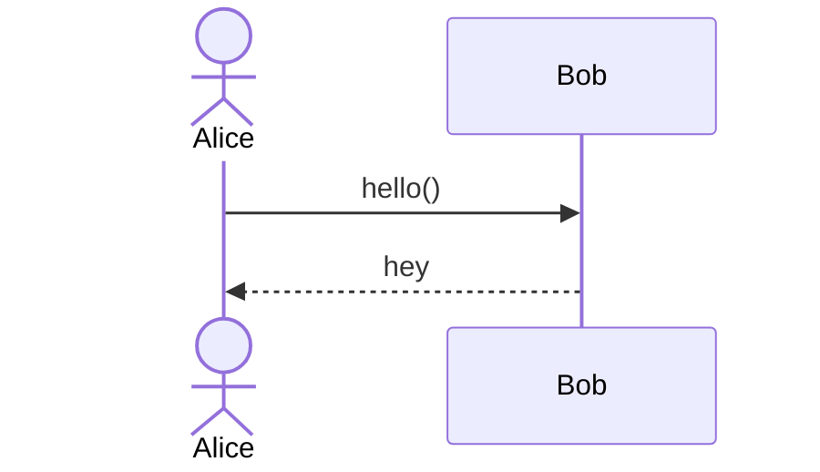
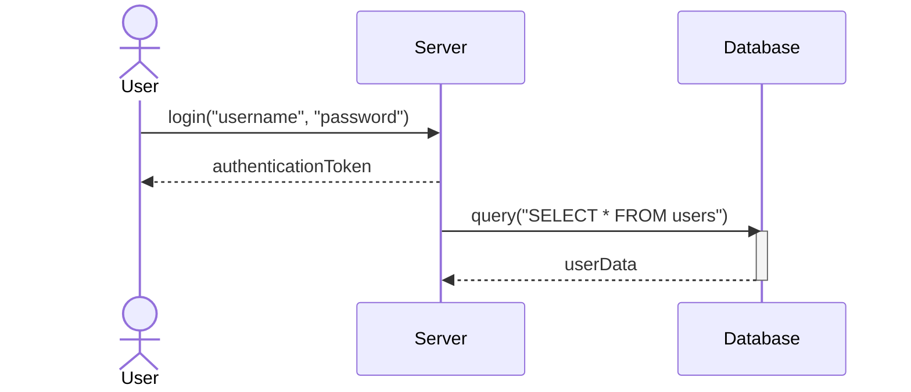
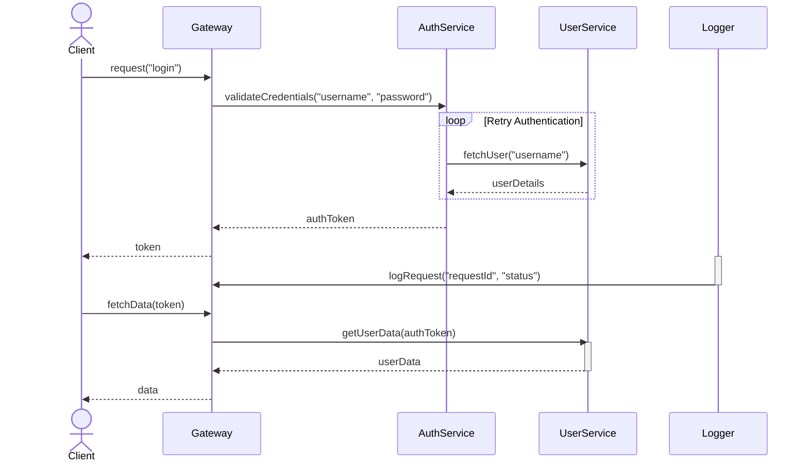

# Another Markdown File

This file contains more mermaid to be parsed and also a different code block to show that the parser understands only to read mermaid.

```go
package main

import "fmt"

func main() {
    fmt.Println("hello world")
}
```





