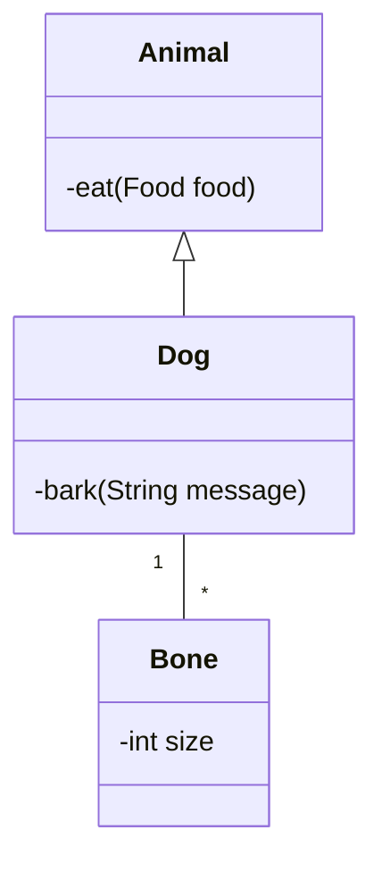

# Documentation

This is a "real world" example of doumentation containing a mermaid diagram.
Using the program on this directory should produce java classes as output.
To demonstrate that Merfolk can read diagrams from multiple files an appropriate situation is given.

