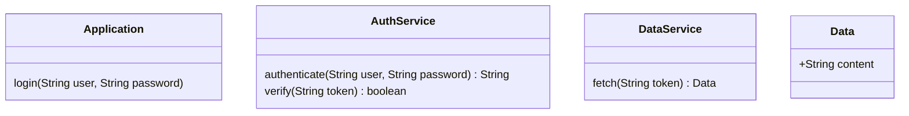

```mermaid
sequenceDiagram
  actor user
  participant Application
  participant AuthService
  participant DataService
  participant Data
  user ->> Application : login()
  Application ->> AuthService : authenticate()
  AuthService -->> Application : sessionToken
  Application ->> DataService : fetch(sessionToken)
  DataService ->> AuthService : verify(sessionToken)
  AuthService -->> DataService : valid
  create participant Data
  DataService ->> Data : Data()
  Data -->> DataService : userData
  DataService ->> Data : setContent()
  DataService -->> Application : userData
  Application -->> user : userData
  
```

