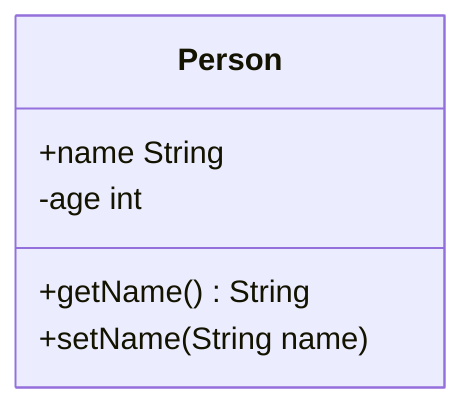
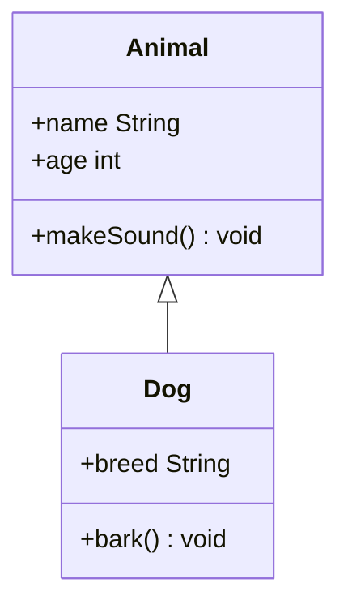
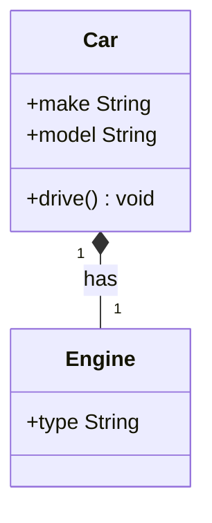
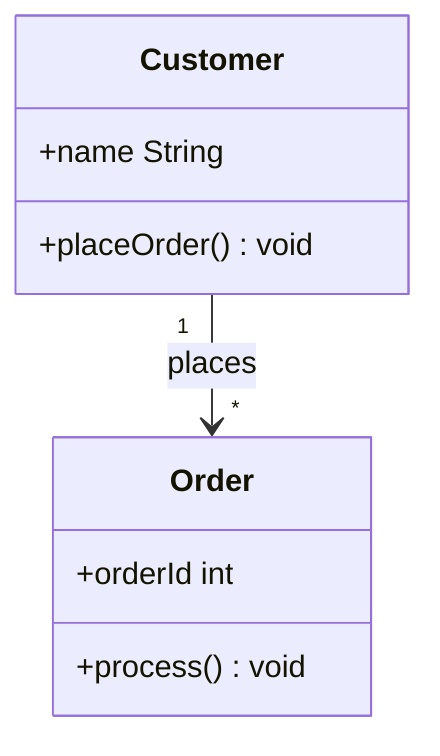

```mermaid
classDiagram
<<interface>> Drawable
Drawable: +draw() void
Circle: +radius int
Circle: +draw() void
Rectangle: +width int
Rectangle: +height int
Rectangle: +draw() void
Drawable <|.. Circle
Drawable <|.. Rectangle


```





```mermaid
classDiagram
<<abstract>> Shape
Shape: +color String
Shape: +draw() void
Circle: +radius int
Circle: +draw() void
Shape <|-- Circle


```