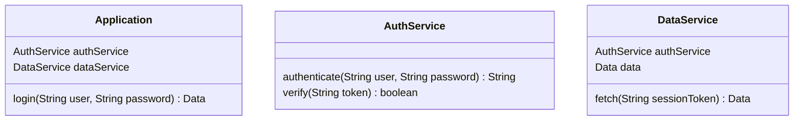
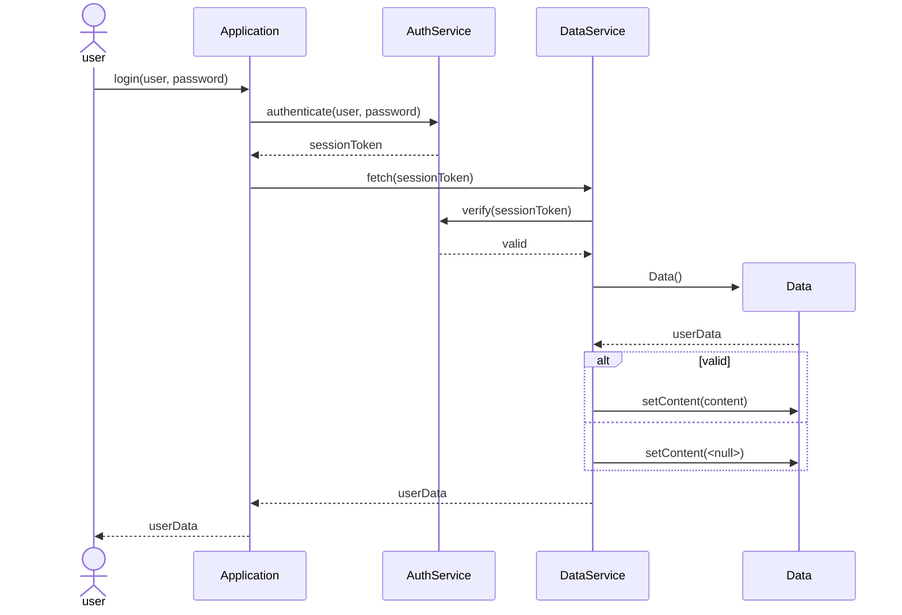

```mermaid
classDiagram
   Application : login(String user, String password) Data
   Application : AuthService authService
   Application : DataService dataService

   AuthService : authenticate(String user, String password) String
   AuthService : verify(String token) boolean

   DataService : fetch(String sessionToken) Data
   DataService : AuthService authService
   DataService : Data data


```

```mermaid
sequenceDiagram
   actor user
   user ->> Application : login(user, password)
   Application ->> AuthService : authenticate(user, password)
   AuthService -->> Application : sessionToken
   Application ->> DataService : fetch(sessionToken)
   DataService ->> AuthService : verify(sessionToken)
   AuthService -->> DataService : valid
   create participant Data
   DataService ->> Data : Data()
   Data -->> DataService : userData
   
   alt valid
    DataService ->> Data : setContent(content)
   else
    DataService ->> Data : setContent(<null>)
   end
   DataService -->> Application : userData
   Application -->> user : userData

  
```