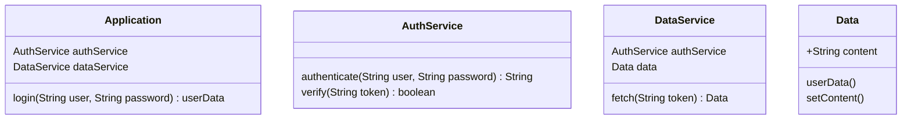
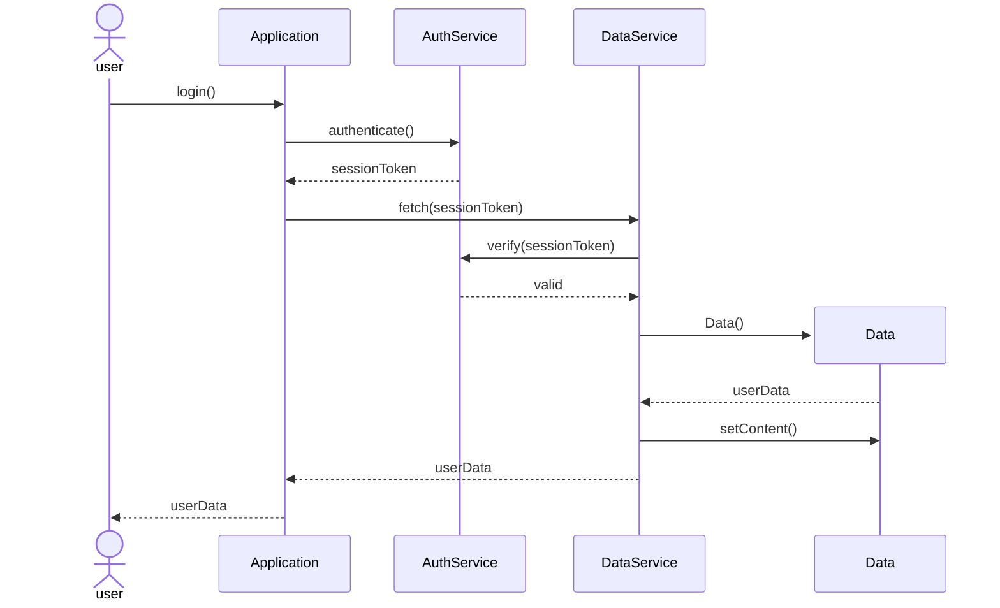

[HELP

connector new workflow
1. first create fucntions for the connector that are able to generate every part of the java code
    a. the class
    b. constructor
    c. functions
    d. return types
    e. object creation
       all the other things
2. now create the complete classes from the class diagram for each class and safe them in a structure or map
   a. attributes
   b. methods
3.  read through the sequence diagram and map the participents to a class
4.  read when an actor calls a participent A this is the starting point
5.  find the class of paricpent A and change the fucntion with the following information from the sequence diagram
6. if that function calls another function from another participent B
7. then find that function in the class of particiepent B and change that function
8. when particiepent B returns the data to participent A then it needs to be returned with a return in the function of class B
9. and in the fuction of Class A it needs to be saved as a variable 
10. if a new participent C gets created in another participent lets say B then an object for C needs to be created in the function of B

If there is no return type or variable type given like String in the class Diagram then ap placeholder type like VARIABLE should be used

